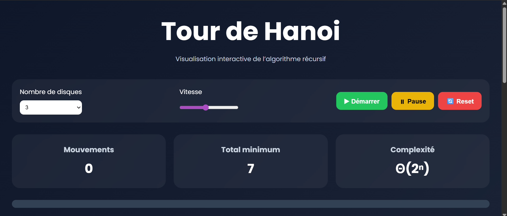

# Tour de Hanoi Visualizer

## Description

Projet de visualisation graphique du célèbre problème récursif **Tour de Hanoi**.

Cette application permet de visualiser étape par étape l’exécution de l’algorithme récursif avec animations interactives.

---

## Technologies utilisées

* HTML5
* CSS3
* JavaScript

---

## Fonctionnalités

* Visualisation graphique des tours
* Animation des déplacements
* Contrôle de vitesse
* Pause / Reprendre
* Historique des mouvements
* Barre de progression
* Affichage de la complexité
* Interface moderne responsive

---

## Concepts algorithmiques

* Récursivité
* Diviser pour Régner
* Complexité algorithmique
* Manipulation du DOM

---

## Complexité

Relation de récurrence :

T(n) = 2T(n-1) + 1

Complexité temporelle :

Θ(2ⁿ)

---

## Aperçu

## Auteur

Projet réalisé par: - BARI Asma
                    - AZENDOURE Nouhaila
                    
